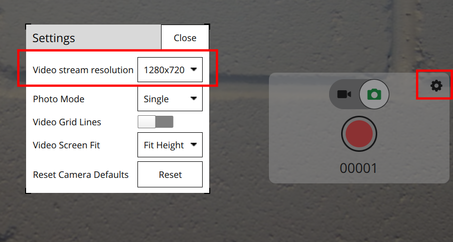

# SIYI A8 mini camera manager

Camera Manager for SIYI A8 mini for RPi based on MAVSDK.

## Prerequisites

This tutorial is using a Raspberry Pi 4 (or 5) with [Raspberry Pi OS](https://www.raspberrypi.com/software/) 64 bits (based on Debian Bullseye or Bookworm) accessible over WiFi using ssh.

If you haven't already, I suggest flashing the RPi's SD card using the [RPi imager](https://github.com/raspberrypi/rpi-imager/). It allows you to set up login passwords, WiFi passwords and ssh support right there before flashing. Connect it to your WiFi, find the IP using your router's web UI, or [look for open ssh ports to find the IP](https://serverfault.com/a/376895). If you have a hard time finding it, consider doing an nmap call before connecting it, and after and then diffing the output.

> [!NOTE]
> If the automatic WiFi connection doesn't work, try the [latest version of rpi-imager](https://github.com/raspberrypi/rpi-imager/releases) from the release page instead of the system installed one.

## Connect to SIYI camera

## Set up static IP on Ethernet

Connect the SIYI camera using the Ethernet adapter cable and an Ethernet cable into the RPi.

We need to set up a static IP for Ethernet in order to talk to SIYI:

### Debian Bullseye - dhcpcd

Edit the file `/etc/dhcpcd.conf`:

```
interface eth0
static ip_address=192.168.144.20/24
static routers=192.168.144.20
static domain_name_servers=8.8.8.8
nogateway
```

To enable it, just unplug Ethernet and plug it back in.

### Debian Bookworm - NetworkManager

To set the ethernet connection to static, use `nmcli`.

First, find the name:

```
sudo nmcli connection show
NAME                UUID                                  TYPE      DEVICE
preconfigured       XXXXXXXX-XXXX-XXXX-XXXX-XXXXXXXXXXXX  wifi      wlan0
lo                  XXXXXXXX-XXXX-XXXX-XXXX-XXXXXXXXXXXX  loopback  lo
Wired connection 1  XXXXXXXX-XXXX-XXXX-XXXX-XXXXXXXXXXXX  ethernet  --
```

Now, set the IP for this `Wired connection 1`:
```
sudo nmcli connection modify 'Wired connection 1' connection.autoconnect yes ipv4.method manual ipv4.address 192.168.144.20/24
```

The settings are saved to `/etc/NetworkManager/system-connections/Wired connection 1.nmconnection` and persist reboots.


### Verify IP and connection

You can check the IP used:

```
ip addr
```

```
...
2: eth0: <BROADCAST,MULTICAST,UP,LOWER_UP> mtu 1500 qdisc mq state UP group default qlen 1000
    link/ether xx:xx:xx:xx:xx:xx brd ff:ff:ff:ff:ff:ff
    inet 192.168.144.20/24 brd 192.168.144.255 scope global noprefixroute eth0
       valid_lft forever preferred_lft forever
    inet6 fe80::2c28:c725:4499:e123/64 scope link
       valid_lft forever preferred_lft forever
...
```

And you should be able to ping the camera:
```
ping 192.168.144.25
```
And see something like
```
PING 192.168.144.25 (192.168.144.25) 56(84) bytes of data.
64 bytes from 192.168.144.25: icmp_seq=1 ttl=64 time=0.368 ms
64 bytes from 192.168.144.25: icmp_seq=2 ttl=64 time=0.710 ms
64 bytes from 192.168.144.25: icmp_seq=3 ttl=64 time=0.175 ms
```

## RTSP re-broadcasting

In order to access the video stream from WiFi, we need to subscribe to the camera's RTSP server and open another RTSP server on the RPi.

This can be done using the [rtsp-rebroadcast](rtsp-rebroadcast/rtsp_rebroadcast.cpp) application which is using gstreamer.

### Build

In order to run the program, you can build it on device for prototyping (or use cross-compilation, or whatever deployment tool you use).

Install the gstreamer dependencies:

```
sudo apt install libgstreamer1.0-dev libgstrtspserver-1.0-dev build-essential cmake git
```

Get the source code, which is part of this repository, either using `scp`, or via a `git clone`.


```
git clone https://github.com/julianoes/siyi-a8-mini-camera-manager.git
```

Then build it on the RPi:

```
cd rtsp-rebroadcast
cmake -Bbuild -S.
cmake --build build
```

### Run

Then run it:

```
build/rtsp_rebroadcast
```
(by default there is no output)

To test the RTSP server, try to connect to it from another computer connected to the same network.

Either using gstreamer:

```
sudo apt install gstreamer1.0-plugins-base-apps

gst-play rtsp://192.168.x.y:8554/live
```

Or ffmpeg:

```
sudo apt install ffmpeg

ffplay rtsp://192.168.x.y:8554/live
```

Or open the URL in VLC.

Note that all these tools add quite a bit of buffering by default, so a delay of 1-3 seconds is quite normal.


## MAVLink camera server

In order to have QGroundControl auto-connect to the video feed and show camera settings, we can use a MAVLink camera server.

The camera manager is implemented using A small application on top of MAVSDK the RTSP URL, as well as camera settings.

### Get MAVSDK

Download the latest MAVSDK release as a .deb. For Raspberry Pi 4 running a 64bit image, this is using the package for the `arm64` architecture:

```
wget https://github.com/mavlink/MAVSDK/releases/download/v2.10.2/libmavsdk-dev_2.10.2_debian12_arm64.deb
sudo dpkg -i libmavsdk-dev_2.10.2_debian12_arm64.deb
```

### Build

Clone or copy this repo on to the the RPi:

Then build:
```
cd camera-manager
cmake -Bbuild -S.
cmake --build build -j4
```

### Run

And run it, passing as positional arguments:
- How MAVSDK should connect to the Pixhawk, for serial: `serial:///dev/serial/to/pixhawk:baudrate`:
- Where MAVSDK should forward MAVLink traffic to (e.g. to QGroundControl): `udp://some.ip.x.y:port`
- Our IP (where RTSP video is available): `our.ip.x.y`

E.g.
```
build/camera_manager serial:///dev/serial/by-id/usb-FTDI_FT232R_USB_UART_A907CB4L-if00-port0:3000000 udp://192.168.1.51:14550 192.168.1.29
```

## Pixhawk connection

There are at least three ways to connect a Pixhawk to the RPi 4:

### 1. Connect to RPi serial pins

Connect Telem 2 to the RPi's pin header pin 8 (GPIO14, UART Tx) and pin 10 (GPIO15, UART Rx), and GND.

Note that this requires bluetooth to be disabled.

In order for the serial connection to work, a couple of settings are required:

- `/boot/config.txt`: Add (or uncomment) `enable_uart=1` and add (or uncomment) `dtoverlay=disable-bt`.
- `/boot/cmdline.txt`: Remove `console=serial0,115200`
- `sudo systemctl disable hciuart`
- `sudo reboot`

There should now be a a serial device on `/dev/serial0` respectively `/dev/ttyAMA0`.

```
ls -l /dev | grep serial
lrwxrwxrwx 1 root root           7 Nov  2 18:35 serial0 -> ttyAMA0
lrwxrwxrwx 1 root root           5 Nov  2 18:35 serial1 -> ttyS0
```

Note that a user must be in the group `dialout` to have access.

### 2. Connect using FTDI cable

Connect Telem 2 to an FTDI cable plugged into the RPi. The serial device should be on `/dev/ttyUSB0` as well as `/dev/serial/by-id/usb-FTDI_...`, e.g.:

```
ls -l /dev/serial/by-id/ grep FTDI
lrwxrwxrwx 1 root root 13 Oct 31 21:55 usb-FTDI_FT232R_USB_UART_A907CB4L-if00-port0 -> ../../ttyUSB0
```

Note that a user must be in the group `dialout` to have access.

### 3. Connect using USB cable

Alternatively, just connect the Pixhawk's USB cable to the RPi. However, this is generally not recommended, as the NuttX USB port is not tested in-flight.
Also, it blocks the port for a firmware update via USB.

In that case the serial device should show up as `/dev/ttACM0`.

## Pixhawk firmware

This currently only properly works with PX4 built from source from the `main` branch. The reason is that forwarding is broken with v1.14.0 and earlier. The plan is to fix this for v1.14.1.

## Enable Telem 2

For case 1 and 2, we need to configure PX4 to send out MAVLink on Telem 2.

To do so, set these params:
- [MAV_1_CONFIG](https://docs.px4.io/v1.14/en/advanced_config/parameter_reference.html#MAV_1_CONFIG) to Telem 2 (102). Then restart the Pixhawk!
- [MAV_1_FLOW_CTRL](https://docs.px4.io/v1.14/en/advanced_config/parameter_reference.html#MAV_1_FLOW_CTRL) to On or Off depending on whether you have RTS and CTS connected.
- [SER_TEL2_BAUD](https://docs.px4.io/v1.14/en/advanced_config/parameter_reference.html#SER_TEL2_BAUD) to 3000000.

## Connect using QGroundControl

You can now try to connect using QGroundControl. Make sure to use the latest release. I've tested it using 4.3.0.

If everything works you should:

- See it connect to the Pixhawk.
- Display the video stream.
- Allow to take pictures, and record video (they should appear on the SD card).
- Show the camera interace and settings. The only settings available for now are the streaming resolution.



## Troubleshooting

### It doesn't work, video does not appear

This could have a couple of reasons:

- Are both processes running, the rtsp-rebroadcast as well as the camera-manager?
- Are all arguments to camera-manager correct?
